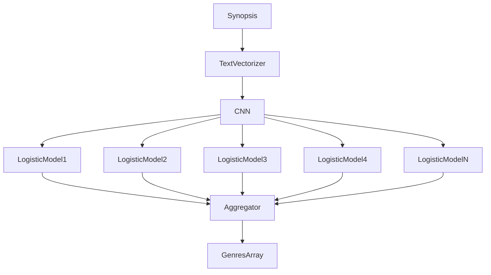

# Anime genres prediction

## Description

Repository with Machine Learning model to predict genres of anime based on synopsis.
Training data was downloaded from [Kaggle](https://www.kaggle.com/datasets/marlesson/myanimelist-dataset-animes-profiles-reviews?select=animes.csv).
File with dataset can be found in repository (`anime.csv`).

## Model architecture

Input: text (synopsis)
Output: array of predicted genres

### Total architecture

### Text Vectorizer

Text vectorization layer implemented using TF-IDF algorithm.
After processing input data ~4000 unique words.
So, output length of text vectorizer is 2000.
Output provided to CNN.

### CNN

CNN consists of 5 layers:.

- Input - size of output of text vectorizer (2000)
- Hidden 1
  - Dense
  - 512 neurons
  - ReLU
- Hidden 2
  - Dense
  - 512 neurons
  - ReLU
- Hidden 3
  - Dense
  - 512 neurons
  - ReLU
- Output
  - Dense
  - 45 neurons (total genres count (44) + UNK)
  - Sigmoid

### Logistic models

For each probability provided by CNN will be trained it's own logistic model.
To speed up learning process we parallelize learning by training models in separate threads using 'joblib' library.

### Aggregation

Finally, we get array of indicators (1 - belongs to genre, 0 - otherwise) that we must convert back to genres strings using vocabulary
